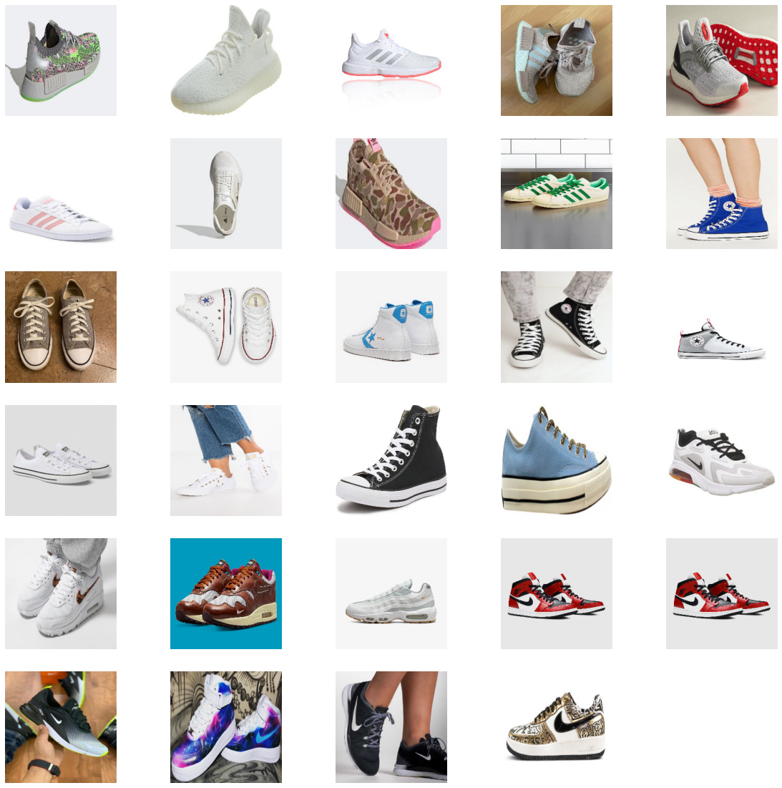

# Shoe-Brand-Classifier
Developed CNN that reads images of shoes and predicts their brand (70% accuracy)

## Overview

A [dataset](https://www.kaggle.com/datasets/die9origephit/nike-adidas-and-converse-imaged) from Kaggle contains images of shoes of 3 different brands: Converse, Nike, and Adidas. The goal of this project was to make a deep learning model that predicts the brand of shoe given the image. The dataset contains only a few hundred photos, so transfer learning using ResNet50V2 was employed. Image augmentation was also applied to broaden the dataset.

## Results

The base model was ResNet50V2, and a Dense layer of 1024 nodes was added on top of this. The model ended after epoch 9 due to early stopping (min_delta = 0.1, patience = 3). The test accuracy was approximately 70%, which is over twice that of random chance (33%). 

